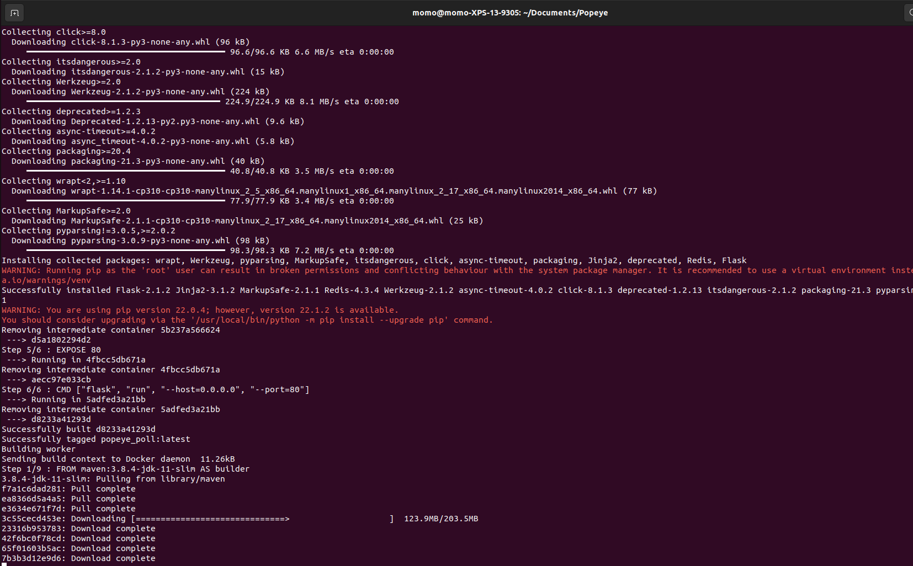

# Popeye

Popeye est projet de fin d'année ou le but du projet est de faire nos premiers pas dans le Devops et dans l'utilisation de Docker.
Dans ce projet, nous allons essayer de maitriser les bases de la conteneurisation d'applications et de la description d'infrastructures multi-conteneurs avec Docker et Docker Compose.
Le but va être d'effectuer le déploiement d'une simple application de sondage Web.

## But du programme

Le but étant d'effectuer les 5 étapes suivantes :

			* Poll, une application Web Flask Python qui rassemble les votes et les pousse dans une file d'attente Redis
			* Redis, qui détient les votes envoyés par l'application Poll, en attendant qu'ils soient consommés par le Worker
			* Worker, une application java qui consomme les votes se trouvant dans la file d'attente Redis et les stocke dans une base de données PostgreSQL
			* Base de données PostgreSQL, qui stocke (de manière persistante) les votes stockés par le Worker
			* Result, une application Web Node.js qui récupère les votes de la base de données et affiche le résultat


## Mise en route

Ces instructions vous permettront d'obtenir une copie du projet opérationnel sur votre machine locale à des fins de développement et de test.

### Pré-requis

Installation de Docker

### Installation


Lancement du projet

```
>> sudo docker-compose build
>> sudo docker-compose run

docker-compose up --build 

Puis pour fermer le container Docker :

>> sudo docker-compose down -v

```
## Captures d'écrans

installation :



